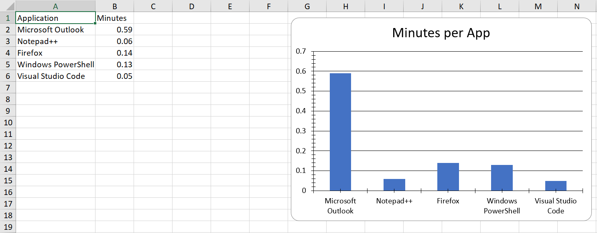

# mymonitor-pipe-importexcel


**TLDR**: 

Pipes output of [Jeff Hicks' MyMonitor](https://github.com/jdhitsolutions/MyMonitor) to [Doug Finke's ImportExcel](https://github.com/dfinke/ImportExcel), for the purpose of generating reports on application usage during recorded sessions.



> [Unix Philosophy:](https://cscie26.dce.harvard.edu/lectures/lect02/6_Extras/ch01s06.html) 
Write programs to work together. 

**Overview**: 

Scripts in this repo can be used on _Windows systems_ to measure which applications were actively used during a monitored session. If the categories of tasks you perform are partitioned by application, it may be possible to use this data to provide insight into how how much time is spent on each category of task.

**Scripts:**
- `CaptureData.ps1` can be used to record session data on actively used applications, along with some browser data.
- `GenerateReport.ps1` uses captured data to generate Excel-based visualizations of session data. Note that the generated .xlsx charts do not display properly in LibreOffice Calc. 

## Quickstart
- Clone the repo, and pull submodules: `git clone --recursive <PROJECT_URL>`
- If you cloned before reading the above instructions, you'll need to run this command to initialize the submodule: `git submodule update --init --recursive`
- Open a [Powershell](https://github.com/PowerShell/PowerShell#get-powershell) session and run the following command `Install-Module ImportExcel -Scope CurrentUser -RequiredVersion 7.8.4`
- In the same Powershell session opened above, `cd` to the root of the repo cloned previously.
- Capture Data:
    ``` ps1
    ./CaptureData.ps1 $sessionLengthInMinutes 1
    ```
- Generate Report:
    ``` ps1
    ./GenerateReport.ps1 # The report will be written to the working directory.
    ```

## Running The Tests
- Open a Powershell session
- Install Pester: `Install-Module Pester -Scope CurrentUser -RequiredVersion 5.4.0 -SkipPublisherCheck`
- In the same Powershell session opened above, `cd` to the `Functions` folder found in the root of this repository.
- Run the tests: `Invoke-Pester`

## Submodules
- This project is using a Git Submodule. 
    - See the [.gitmodules file](./.gitmodules) for details.
    - See these docs for info on Git Submodules: https://github.blog/2016-02-01-working-with-submodules/

